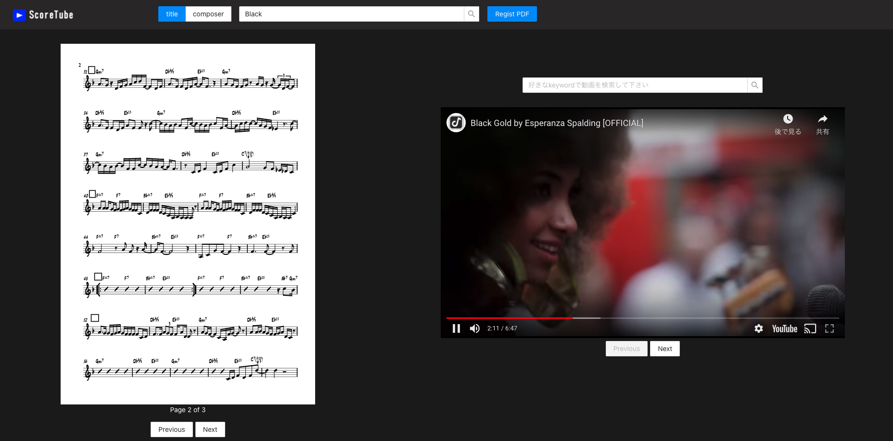

# ScoreTube
楽譜pdfの管理ツールです。以下のことができます。
* 楽譜を見ながらyoutubeで楽曲検索
* 楽譜の登録
* 登録した楽譜の検索

### Usage
YoutubeのAPIキーが必要なので事前に取得し、`client/.env`内に`REACT_APP_YOUTUBE_API_KEY`として定義してください。

* 起動  
`$ docker-compose up -d --build`
* Access  
`http://localhost:3000`
### UI

